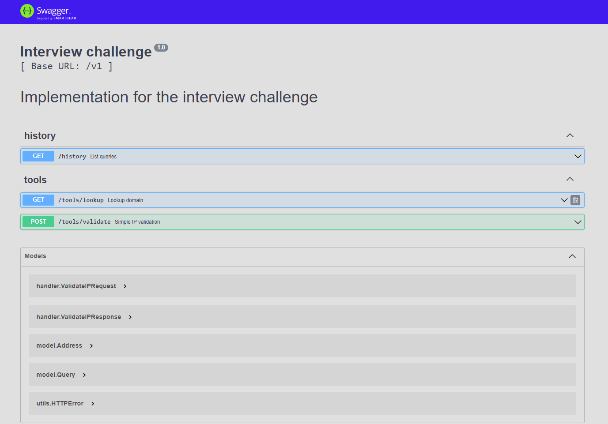

# fish-test-app

This is test node.js application for stake.fish

Prefered development enviornment is gitpod

Simple build and run

```
docker-compose up -d --build
```

## Swagger UI endpoint : `/api-docs`
this is the client of server that can test apis throught ui.


- The prothemeus metrics endpoint is `/metrics` and the handler is quite standard.
- The `/health` endpoint always responds with status 200 


## Kubernetes deployment using manifest

```
kubectl create -f nodejs-service.yaml,nodejs-deployment.yaml,nodejs-claim0-persistentvolumeclaim.yaml,node-modules-persistentvolumeclaim.yaml,db-service.yaml,db-deployment.yaml,dbdata-persistentvolumeclaim.yaml,secret.yaml
```
